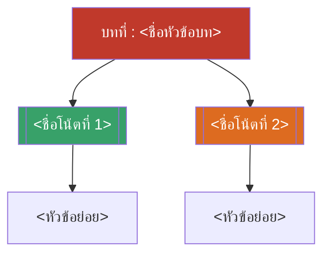

# บทที่ <N> — <ชื่อหัวข้อบทภาษาอังกฤษสั้น ๆ> (MOC)

arrow_back บทก่อนหน้า: [[Chapter<N-1>-MOC|MOC บทที่ <N-1>]]

<!-- ถ้าเป็นบทแรกของวิชา (ไม่มีบทก่อนหน้า) ให้ลบบรรทัดนี้ทิ้ง -->

## check_circle เช็คลิสต์ก่อนเข้าเรียน

- [ ] <รายการเตรียมตัวก่อนเข้าเรียน> — ดู [[<ชื่อโน้ตหัวข้อ>]]
- [ ] <รายการเตรียมตัวก่อนเข้าเรียน>

## assignment ภาพรวมบทที่ <N> (สรุปย่อ)

<ย่อหน้าสรุปภาพรวมเนื้อหาของบทนี้ อาจแบ่งเป็นข้อย่อย 1. 2. 3. ตามหัวข้อหลักได้ถ้าเนื้อหามีหลายส่วน>

## map แผนที่หัวข้อบทที่ <N>

## collections_bookmark โน้ตรายหัวข้อ

| หัวข้อ | เนื้อหาหลัก | หน้าสไลด์ |
| --- | --- | --- |
| [[<ชื่อโน้ตที่ 1>]] | <สรุปเนื้อหาสั้น ๆ> | <ช่วงเลขหน้า> |
| [[<ชื่อโน้ตที่ 2>]] | <สรุปเนื้อหาสั้น ๆ> | <ช่วงเลขหน้า> |

> [!info] สอบย่อยที่เกี่ยวข้อง
> <ระบุว่าเนื้อหาบทนี้อยู่ในสอบย่อยครั้งที่เท่าไหร่ วันที่เท่าไหร่ — ดู [[../../Deadline-Tracker|Deadline Tracker]]>

arrow_forward บทถัดไป: [[Chapter<N+1>-MOC|MOC บทที่ <N+1>]]

<!-- ถ้ายังไม่มีโน้ตของบทถัดไป ให้ลบบรรทัดนี้ก่อน แล้วค่อยเติมทีหลังตอนสร้าง MOC บทถัดไป -->
