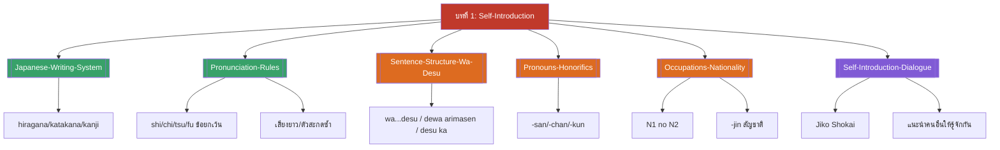

# บทที่ 1 — Self-Introduction (MOC)

## ✅ เช็คลิสต์ก่อนเข้าเรียน

- [ ] ทบทวนตัวอักษร 3 แบบของภาษาญี่ปุ่น (hiragana/katakana/kanji) — ดู [[Japanese-Writing-System]]
- [ ] ฝึกออกเสียงพยัญชนะแถว K-S-T-N-H-M-Y-R-W และจุดยกเว้น shi/chi/tsu/fu — ดู [[Pronunciation-Rules]]
- [ ] ทบทวนโครงสร้างประโยค N wa N desu ให้คล่อง — ดู [[Sentence-Structure-Wa-Desu]]

## 📋 ภาพรวมบทที่ 1 (สรุปย่อ)

บทเปิดเทอมนี้ปูพื้นฐานภาษาญี่ปุ่นตั้งแต่ระบบการเขียน ไปจนถึงการแนะนำตัวจริงในบทสนทนา แบ่งเป็น 6 ส่วน:

1. **ระบบตัวอักษร** — hiragana, katakana, kanji และการผสมใช้ในประโยคเดียว
2. **กฎการออกเสียง** — พยัญชนะ+สระพื้นฐาน, จุดยกเว้น (shi/chi/tsu/fu), เสียงควบ, เสียงยาว, ตัวสะกด -n, ตัวสะกดซ้ำ (っ)
3. **โครงสร้างประโยคพื้นฐาน** — N wa N desu / dewa arimasen / desu ka และคำช่วย mo
4. **สรรพนามและคำต่อท้ายยศ** — watashi/anata/anohito, -san/-chan/-kun, donata/dare
5. **อาชีพ สัญชาติ และคำช่วย no** — คำศัพท์อาชีพ/ประเทศ, N1 no N2, -jin, kara kimashita
6. **บทสนทนาการแนะนำตัวจริง** — jiko shōkai, การแนะนำคนอื่นให้รู้จักกัน, บทสนทนาที่แผนกต้อนรับและหน้าประตูบ้าน

บทนี้เป็นพื้นฐานที่ทุกบทถัดไปอ้างอิงกลับมาใช้ (โครงสร้าง wa/desu และคำช่วย no โดยเฉพาะ)

## 🗺️ แผนที่หัวข้อบทที่ 1

## 📚 โน้ตรายหัวข้อ

| หัวข้อ | เนื้อหาหลัก | หน้าสไลด์ |
| --- | --- | --- |
| [[Japanese-Writing-System]] | hiragana, katakana, kanji และการผสมใช้ | 1-15 |
| [[Pronunciation-Rules]] | พยัญชนะ+สระ, shi/chi/tsu/fu, เสียงยาว, -n, ตัวสะกดซ้ำ | 16-40 |
| [[Sentence-Structure-Wa-Desu]] | N wa N desu / dewa arimasen / desu ka, mo | 41-55 |
| [[Pronouns-Honorifics]] | watashi/anata/anohito, -san/-chan/-kun, donata/dare | 56-70 |
| [[Occupations-Nationality]] | อาชีพ, ประเทศ, N1 no N2, -jin, kara kimashita | 71-90 |
| [[Self-Introduction-Dialogue]] | jiko shōkai, แนะนำคนอื่น, บทสนทนาจริง | 91-106 |

> [!info] สอบย่อยที่เกี่ยวข้อง
> เนื้อหาบทนี้อยู่ใน **สอบย่อยครั้งที่ 1 (บทที่ 1-2), วันพุธ 23 กันยายน 2569** — ดู [[../../02_Labs_Assignments/Quiz1-Prep|Quiz1-Prep]] และ [[../../Deadline-Tracker|Deadline Tracker]]

> [!tip] บทเปิดเทอม
> วันแรก (พุธ 9 กย 2569) สอนแค่แนะนำรายวิชา + เริ่มบทที่ 1 — เนื้อหาเต็มของบทนี้ต่อเนื่องไปถึงสัปดาห์ที่ 2 (พุธ 16 กย) ซึ่งเรียนคู่กับบทที่ 2

➡️ บทถัดไป: [[../Chapter2/Chapter2-MOC|MOC บทที่ 2]]
