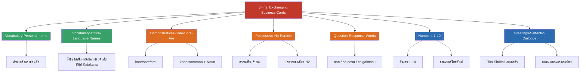

# บทที่ 2 — Exchanging Business Cards (MOC)

arrow_back บทก่อนหน้า: [[../Chapter1/Chapter1-MOC|MOC บทที่ 1]]

## check_circle เช็คลิสต์ก่อนเข้าเรียน

- [ ] ทบทวนคำศัพท์สิ่งของส่วนตัวและสำนักงาน (รวมคำทับศัพท์คาตาคานะ) — ดู [[Vocabulary-Personal-Items]], [[Vocabulary-Office-Language-Names]]
- [ ] ทบทวน kore/sore/are และ kono/sono/ano ให้คล่อง — ดู [[Demonstratives-Kore-Sore-Are]]
- [ ] ท่องตัวเลข 1–10 และรูปแบบอ่านเบอร์โทรศัพท์ — ดู [[Numbers-1-10]]

## assignment ภาพรวมบทที่ 2 (สรุปย่อ)

บทนี้สอนการแนะนำตัวเชิงธุรกิจและการแลกนามบัตร: 1) คำศัพท์สิ่งของส่วนตัวและสิ่งของสำนักงาน รวมถึงชื่อภาษาและคำทับศัพท์คาตาคานะที่พบบ่อย 2) คำชี้เฉพาะ kore/sore/are และ kono/sono/ano ซึ่งเป็นแกนไวยากรณ์ที่ใช้ต่อเนื่องไปถึงบทที่ 4 3) โครงสร้าง N1 no N2 ทั้งแบบแสดงความเป็นเจ้าของและบอกรายละเอียด 4) คำถาม-คำตอบพื้นฐาน (nan, sō desu/chigaimasu) 5) ตัวเลข 1-10 และการอ่านเบอร์โทรศัพท์ และ 6) คำทักทายสุภาพ การแนะนำตัวเชิงธุรกิจ (Jiko Shōkai) และบทสนทนาแลกนามบัตรจริง

## map แผนที่หัวข้อบทที่ 2

## collections_bookmark โน้ตรายหัวข้อ

| หัวข้อ | เนื้อหาหลัก | หน้าสไลด์ |
| --- | --- | --- |
| [[Vocabulary-Personal-Items]] | คำนามสิ่งของส่วนตัว (hon, jisho, zasshi, kagi, tokei ฯลฯ) | ตามลำดับสไลด์ |
| [[Vocabulary-Office-Language-Names]] | สิ่งของสำนักงาน, ชื่อภาษา, คำทับศัพท์ Katakana | ตามลำดับสไลด์ |
| [[Demonstratives-Kore-Sore-Are]] | คำชี้เฉพาะ kore/sore/are, kono/sono/ano | ตามลำดับสไลด์ |
| [[Possessive-No-Particle]] | N1 no N2 (เจ้าของ + รายละเอียด) | ตามลำดับสไลด์ |
| [[Question-Response-Words]] | nan, hai/ē, sō desu/chigaimasu | ตามลำดับสไลด์ |
| [[Numbers-1-10]] | ตัวเลข 1-10, การอ่านเบอร์โทรศัพท์ | ตามลำดับสไลด์ |
| [[Greetings-Self-Intro-Dialogue]] | คำทักทายสุภาพ, Jiko Shōkai, บทสนทนาแลกนามบัตร | ตามลำดับสไลด์ |

> [!info] สอบย่อยที่เกี่ยวข้อง
> เนื้อหาบทที่ 2 อยู่ใน **สอบย่อยครั้งที่ 1 (บทที่ 1-2), วันพุธ 23 กันยายน 2569** — ดู [[../../02_Labs_Assignments/Quiz1-Prep|Quiz1-Prep]] และ [[../../Deadline-Tracker|Deadline Tracker]]

> [!tip] จุดที่มักสับสนที่สุดในบทนี้
> โครงสร้าง N1 no N2 อ่านลำดับกลับกับภาษาไทย (N1 ผู้เป็นเจ้าของ/รายละเอียด มาก่อนเสมอ) และ kore/sore/are ต้องแยกจาก kono/sono/ano ให้ชัด — kono/sono/ano ต้องมีคำนามตามหลังเสมอ ไม่พูดลอย ๆ ส่วน Sō desu / Chigaimasu ต่างจาก Sō desuka ที่ใช้ตอบรับข้อมูลใหม่ ไม่ใช่คำถาม

arrow_forward บทถัดไป: [[../Chapter3/Chapter3-MOC|MOC บทที่ 3]]
