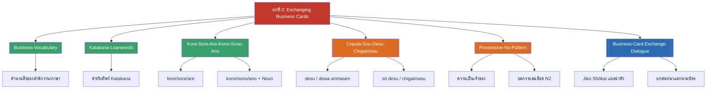

# บทที่ 2 — Exchanging Business Cards (MOC)

⬅️ บทก่อนหน้า: [[../Chapter1/Chapter1-MOC|MOC บทที่ 1]]

## ✅ เช็คลิสต์ก่อนเข้าเรียน

- [ ] ทบทวนคำศัพท์สิ่งของสำนักงานและคำทับศัพท์คาตาคานะ — ดู [[Business-Vocabulary]], [[Katakana-Loanwords]]
- [ ] ทบทวน kore/sore/are และ kono/sono/ano ให้คล่อง — ดู [[Kore-Sore-Are-Kono-Sono-Ano]]
- [ ] ท่องตัวเลข 1–10 และรูปแบบอ่านเบอร์โทรศัพท์ — ดู [[Business-Card-Exchange-Dialogue]]

## 📋 ภาพรวมบทที่ 2 (สรุปย่อ)

บทนี้สอนการแนะนำตัวเชิงธุรกิจและการแลกนามบัตร: 1) คำศัพท์สิ่งของสำนักงานและคำทับศัพท์คาตาคานะที่พบบ่อย 2) คำชี้เฉพาะ kore/sore/are และ kono/sono/ano ซึ่งเป็นแกนไวยากรณ์ที่ใช้ต่อเนื่องไปถึงบทที่ 4 3) รูปแบบยืนยัน/ปฏิเสธ desu/dewa arimasen และการตอบคำถามด้วย sō desu/chigaimasu 4) โครงสร้าง N1 no N2 ทั้งแบบแสดงความเป็นเจ้าของและบอกรายละเอียด และ 5) บทสนทนาแนะนำตัวและแลกนามบัตรแบบเป็นทางการ พร้อมการอ่านเบอร์โทรศัพท์

## 🗺️ แผนที่หัวข้อบทที่ 2

## 📚 โน้ตรายหัวข้อ

| หัวข้อ | เนื้อหาหลัก | หน้าสไลด์ |
| --- | --- | --- |
| [[Business-Vocabulary]] | คำนามสิ่งของสำนักงาน/ภาษา | 1–19 |
| [[Katakana-Loanwords]] | คำทับศัพท์ที่ใช้อักษร Katakana | 20–36 |
| [[Kore-Sore-Are-Kono-Sono-Ano]] | คำชี้เฉพาะ kore/sore/are, kono/sono/ano | 37, 62–63 |
| [[Copula-Sou-Desu-Chigaimasu]] | desu/dewa arimasen, sō desu/chigaimasu | 64–75 |
| [[Possessive-No-Pattern]] | N1 no N2 (เจ้าของ + รายละเอียด) | 76–79 |
| [[Business-Card-Exchange-Dialogue]] | Jiko Shōkai, บทสนทนาแลกนามบัตร, เบอร์โทร | 38–61, 80–83 |

> [!info] สอบย่อยที่เกี่ยวข้อง
> เนื้อหาบทที่ 2 อยู่ใน **สอบย่อยครั้งที่ 1 (บทที่ 1-2), วันพุธ 23 กันยายน 2569** — ดู [[../../02_Labs_Assignments/Quiz1-Prep|Quiz1-Prep]] และ [[../../Deadline-Tracker|Deadline Tracker]]

> [!tip] จุดที่มักสับสนที่สุดในบทนี้
> โครงสร้าง N1 no N2 อ่านลำดับกลับกับภาษาไทย (N1 ผู้เป็นเจ้าของ/รายละเอียด มาก่อนเสมอ) และ kore/sore/are ต้องแยกจาก kono/sono/ano ให้ชัด — kono/sono/ano ต้องมีคำนามตามหลังเสมอ ไม่พูดลอย ๆ

➡️ บทถัดไป: [[../Chapter3/Chapter3-MOC|MOC บทที่ 3]]
