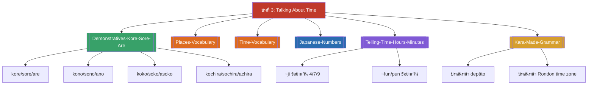

# บทที่ 3 — Talking About Time (MOC)

⬅️ บทก่อนหน้า: [[../Chapter2/Chapter2-MOC|MOC บทที่ 2]]

## ✅ เช็คลิสต์ก่อนเข้าเรียน

- [ ] ทบทวนระบบคำชี้เฉพาะ こそあど (kore/kono/koko/kochira) — ดู [[Demonstratives-Kore-Sore-Are]]
- [ ] ท่องคำศัพท์สถานที่/เวลาและตัวเลข 1-100 ให้คล่อง — ดู [[Places-Vocabulary]], [[Time-Vocabulary]], [[Japanese-Numbers]]
- [ ] ฝึกอ่านเลขโมง/นาทีที่มีข้อยกเว้นการออกเสียง (4=yo-ji, 7=shichi-ji, 9=ku-ji, 1/3/4/6/8/10/100 นาที) — ดู [[Telling-Time-Hours-Minutes]]

## 📋 ภาพรวมบทที่ 3 (สรุปย่อ)

บทนี้สอนการพูดคุยเรื่องเวลาเป็นหลัก แบ่งเป็น 5 ส่วน:

1. **คำชี้เฉพาะ (こそあど)** — kore/sore/are, kono/sono/ano, koko/soko/asoko, kochira/sochira/achira ใช้บอกตำแหน่ง/สิ่งของตามระยะห่างจากผู้พูด-คู่สนทนา
2. **คำศัพท์สถานที่** — ชื่อสถานที่ (ห้างสรรพสินค้า ซูเปอร์มาร์เก็ต ที่ทำการไปรษณีย์ ฯลฯ)
3. **คำศัพท์เวลาและกิจกรรม** — พักเที่ยง ปาร์ตี้ ภาพยนตร์ งาน ประชุม, gozen/gogo
4. **ตัวเลขภาษาญี่ปุ่น 1-100** — พื้นฐานสำหรับบอกเวลาและจำนวน
5. **การบอกเวลา** — ถามกี่โมง ตอบด้วยลักษณนามชั่วโมง/นาที (มีข้อยกเว้นการออกเสียงหลายจุด) รวมถึง chōdo, daitai, sugi, mō sugu
6. **โครงสร้าง kara...made** — บอกช่วงเวลาเปิด-ปิดของสถานที่/กิจกรรม พร้อมบทสนทนาตัวอย่างจริง 2 บท

## 🗺️ แผนที่หัวข้อบทที่ 3

## 📚 โน้ตรายหัวข้อ

| หัวข้อ | เนื้อหาหลัก | หน้าสไลด์ |
| --- | --- | --- |
| [[Demonstratives-Kore-Sore-Are]] | ระบบคำชี้เฉพาะ こそあど 4 ชุด | 1-6 |
| [[Places-Vocabulary]] | คำศัพท์สถานที่ 12 คำ | 7-13 |
| [[Time-Vocabulary]] | คำศัพท์เวลา/กิจกรรม, gozen/gogo | 14-18 |
| [[Japanese-Numbers]] | ตัวเลข 1-100 | 41-43 |
| [[Telling-Time-Hours-Minutes]] | ~ji, ~fun/pun, gozen/gogo, chōdo, daitai, sugi, mō sugu | 19-40, 44-49 |
| [[Kara-Made-Grammar]] | kara...made + บทสนทนาตัวอย่าง 2 บท | 50-60 |

> [!info] สอบย่อยที่เกี่ยวข้อง
> เนื้อหาบทที่ 3 อยู่ใน **สอบย่อยครั้งที่ 2 (บทที่ 3-4), วันพุธ 14 ตุลาคม 2569** — ดู [[../../02_Labs_Assignments/Quiz2-Prep|Quiz2-Prep]] และ [[../../Deadline-Tracker|Deadline Tracker]]

➡️ บทถัดไป: [[../Chapter4/Chapter4-MOC|MOC บทที่ 4]]
