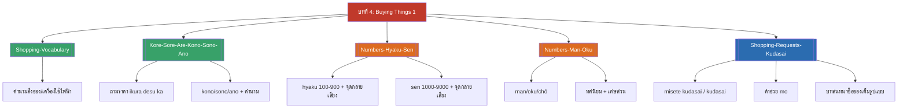

# บทที่ 4 — Buying Things 1 (MOC)

⬅️ บทก่อนหน้า: [[../Chapter3/Chapter3-MOC|MOC บทที่ 3]]

## ✅ เช็คลิสต์ก่อนเข้าเรียน

- [ ] ทบทวนคำศัพท์เครื่องใช้ไฟฟ้า/สิ่งของในร้าน — ดู [[Shopping-Vocabulary]]
- [ ] ท่องตัวเลข 100–9,000 พร้อมจุดกลายเสียง (300/600/800/3,000/8,000) — ดู [[Numbers-Hyaku-Sen]]
- [ ] ท่องตัวเลขหลักหมื่นขึ้นไป (man/oku) — ดู [[Numbers-Man-Oku]]

## 📋 ภาพรวมบทที่ 4 (สรุปย่อ)

บทนี้สอนการซื้อของในร้านค้า: 1) คำศัพท์สิ่งของ/เครื่องใช้ไฟฟ้าที่ซื้อขายกันทั่วไป 2) การถามและตอบราคาด้วย kore/sore/are wa ikura desu ka และการระบุของด้วย kono/sono/ano + คำนาม 3) ระบบตัวเลขญี่ปุ่นแบบเต็ม ตั้งแต่หลักร้อยถึงล้าน รวมทั้งทศนิยมและเศษส่วน (จุดสำคัญที่สุดของบทคือระบบนับหลัก 4 หลัก — man ที่หลักหมื่น ต่างจากระบบไทย/อังกฤษที่นับหลัก 3 หลัก) และ 4) สำนวนที่ใช้จริงในร้านค้า ทั้งขอดูของ (misete kudasai) ขอซื้อ (kudasai) คำช่วย mo (ก็เหมือนกัน) และการถามเรื่องบัตรเครดิต

## 🗺️ แผนที่หัวข้อบทที่ 4

## 📚 โน้ตรายหัวข้อ

| หัวข้อ | เนื้อหาหลัก | หน้าสไลด์ |
| --- | --- | --- |
| [[Shopping-Vocabulary]] | คำศัพท์สิ่งของ/เครื่องใช้ไฟฟ้าในร้าน | 1–10 |
| [[Kore-Sore-Are-Kono-Sono-Ano]] | ถามราคา + คำชี้เฉพาะ kono/sono/ano | 11–17 |
| [[Numbers-Hyaku-Sen]] | ตัวเลข 100–9,000 และจุดกลายเสียง | 18–29 |
| [[Numbers-Man-Oku]] | ตัวเลขหลักหมื่นขึ้นไป, ทศนิยม, เศษส่วน | 30–41 |
| [[Shopping-Requests-Kudasai]] | misete kudasai, kudasai, คำช่วย mo, บทสนทนาเต็ม | 42–52 |

> [!info] สอบย่อยที่เกี่ยวข้อง
> เนื้อหาบทที่ 4 อยู่ใน **สอบย่อยครั้งที่ 2 (บทที่ 3-4), วันพุธ 14 ตุลาคม 2569** — ดู [[../../02_Labs_Assignments/Quiz2-Prep|Quiz2-Prep]] และ [[../../Deadline-Tracker|Deadline Tracker]]

> [!tip] จุดที่มักสับสนที่สุดในบทนี้
> ระบบนับเลขหลักหมื่น (man) ต่างจากภาษาไทย/อังกฤษที่นับหลักพัน — 100,000 คือ "jū-man" ไม่ใช่ "hyaku-sen" ต้องฝึกแยกระบบให้คล่องก่อนสอบ

➡️ บทถัดไป: [[../Chapter5/Chapter5-MOC|MOC บทที่ 5]]
