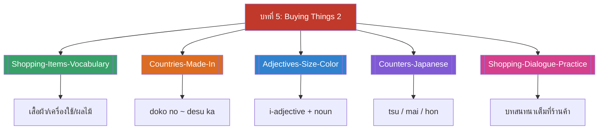

# บทที่ 5 — Buying Things 2 (MOC)

⬅️ บทก่อนหน้า: [[../Chapter4/Chapter4-MOC|MOC บทที่ 4]]

## ✅ เช็คลิสต์ก่อนเข้าเรียน

- [ ] ทบทวนคำศัพท์สิ่งของที่ซื้อขาย — ดู [[Shopping-Items-Vocabulary]]
- [ ] ทบทวนวิธีถามแหล่งผลิตสินค้า — ดู [[Countries-Made-In]]
- [ ] ทบทวนคำคุณศัพท์บอกขนาด/สี — ดู [[Adjectives-Size-Color]]
- [ ] ทบทวนลักษณนามทั้ง 3 แบบ (tsu/mai/hon) — ดู [[Counters-Japanese]]

## 📋 ภาพรวมบทที่ 5 (สรุปย่อ)

บทที่ 5 ต่อยอดจากบทที่ 4 (การซื้อของ 1) โดยเพิ่มความสามารถในการ:

1. ถามและบอกแหล่งผลิต/ประเทศต้นทางของสินค้า ("doko no X desu ka" / "[ประเทศ] no desu")
2. บรรยายสินค้าด้วยคำคุณศัพท์ขนาดและสี (ōkii/chiisai, akai/kuroi/shiroi/kiiroi/aoi)
3. ระบุจำนวนสินค้าที่ต้องการซื้อด้วยลักษณนามที่ถูกต้องตามชนิดของสิ่งของ 3 แบบ (つ ทั่วไป, 枚 ของแบน, 本 ของทรงยาว) รวมถึงจำการเปลี่ยนเสียงที่ผิดปกติของ 本 (ippon, roppon, happon, juppon)
4. ผสมทุกโครงสร้างเข้าด้วยกันเป็นบทสนทนาซื้อของแบบเต็มที่ร้านค้า

## 🗺️ แผนที่หัวข้อบทที่ 5

## 📚 โน้ตรายหัวข้อ

| หัวข้อ | เนื้อหาหลัก | หน้าสไลด์ |
| --- | --- | --- |
| [[Shopping-Items-Vocabulary]] | คำศัพท์สิ่งของ + โครงสร้างบอกราคา | 1-9 |
| [[Countries-Made-In]] | ชื่อประเทศ + doko no ~ desu ka | 10-20 |
| [[Adjectives-Size-Color]] | ōkii/chiisai + สีทั้ง 5 | 21-24 |
| [[Counters-Japanese]] | ลักษณนาม つ/枚/本 | 33-39 |
| [[Shopping-Dialogue-Practice]] | บทสนทนาเต็มรวมทุกโครงสร้าง | 42-49 |

> [!info] สอบย่อยที่เกี่ยวข้อง
> เนื้อหาบทที่ 5 นี้อยู่ใน **สอบย่อยครั้งที่ 3 (บทที่ 5-6), วันพุธ 4 พฤศจิกายน 2569** — ดู [[../../Deadline-Tracker|Deadline Tracker]] นอกจากนี้ยังเป็นเนื้อหาหลักที่ใช้ในงานกลุ่ม Role Play (คำศัพท์ตัวเลข ราคา คำคุณศัพท์)

➡️ บทถัดไป: [[../Chapter6/Chapter6-MOC|MOC บทที่ 6]]
