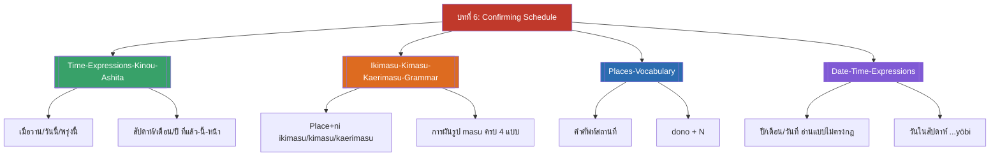

# บทที่ 6 — Confirming Schedule (MOC)

⬅️ บทก่อนหน้า: [[../Chapter5/Chapter5-MOC|MOC บทที่ 5]]

## ✅ เช็คลิสต์ก่อนเข้าเรียน

- [ ] ทบทวนคำบอกเวลาสัมพัทธ์ (เมื่อวาน/วันนี้/พรุ่งนี้ ฯลฯ) — ดู [[Time-Expressions-Kinou-Ashita]]
- [ ] ทบทวนการผันคำกริยารูป masu จากบทก่อนหน้า ก่อนต่อยอดกับ ikimasu/kimasu/kaerimasu — ดู [[Ikimasu-Kimasu-Kaerimasu-Grammar]]
- [ ] ทบทวนคำศัพท์สถานที่ (ธนาคาร ห้าง สถานี สนามบิน) — ดู [[Places-Vocabulary]]

## 📋 ภาพรวมบทที่ 6 (สรุปย่อ)

บทนี้สอนวิธียืนยันตารางงาน/นัดหมาย โดยครอบคลุม 4 ส่วนหลัก:

1. **คำบอกเวลาสัมพัทธ์** (เมื่อวาน/วันนี้/พรุ่งนี้, สัปดาห์/เดือน/ปี ที่แล้ว-นี้-หน้า) ใช้เป็นกรอบเวลาของประโยค
2. **กริยาไป-มา-กลับ** (ikimasu/kimasu/kaerimasu) พร้อมรูปแบบ "สถานที่+ni" และ "คน+to" (ไปกับใคร) รวมถึงการผันรูปครบ 4 แบบ (ปัจจุบัน/อดีต × บอกเล่า/ปฏิเสธ)
3. **คำศัพท์สถานที่และการเดินทาง** (สนามบิน สถานี สาขาบริษัท รถบัส คนขับรถ) พร้อมคำถามเลือก "dono + N" (อันไหน)
4. **การบอกวันเดือนปีแบบเต็ม** (ปี-เดือน-วันที่-วัน) ซึ่งเป็นหัวใจของ "การยืนยันตารางงาน" ตามชื่อบท — ใช้ตอบคำถาม nan gatsu / nan nichi / nan yōbi desu ka

## 🗺️ แผนที่หัวข้อบทที่ 6

## 📚 โน้ตรายหัวข้อ

| หัวข้อ | เนื้อหาหลัก | หน้าสไลด์ |
| --- | --- | --- |
| [[Time-Expressions-Kinou-Ashita]] | เมื่อวาน/วันนี้/พรุ่งนี้, สัปดาห์/เดือน/ปี ที่แล้ว-นี้-หน้า | หน้า 4-8 |
| [[Ikimasu-Kimasu-Kaerimasu-Grammar]] | กริยาไป-มา-กลับ, Place+ni, N+to, hitori de, การผันรูป | หน้า 9-16, 41-48 |
| [[Places-Vocabulary]] | คำศัพท์สถานที่, dono+N, บทสนทนาป้ายรถเมล์ | หน้า 17-25, 62-68 |
| [[Date-Time-Expressions]] | ปี/เดือน/วันที่/วันในสัปดาห์, nan gatsu/nichi/yōbi desu ka | หน้า 26-40, 49-60 |

> [!info] สอบย่อยที่เกี่ยวข้อง
> เนื้อหาบทที่ 6 (พร้อมบทที่ 5) อยู่ใน **สอบย่อยครั้งที่ 3 (บทที่ 5-6), วันพุธ 4 พฤศจิกายน 2569** — ดู [[../../Deadline-Tracker|Deadline Tracker]]

> [!tip] บทนี้เป็นบทสุดท้ายก่อนสอบปลายภาค
> หลังบทที่ 6 คือ **สอบการฟังและการพูดปลายภาค วันพุธ 11 พฤศจิกายน 2569** ซึ่งครอบคลุมเนื้อหาทั้ง 6 บท — ดู [[../../04_Exams_Review/Final-Exam-Review|Final Exam Review]]
